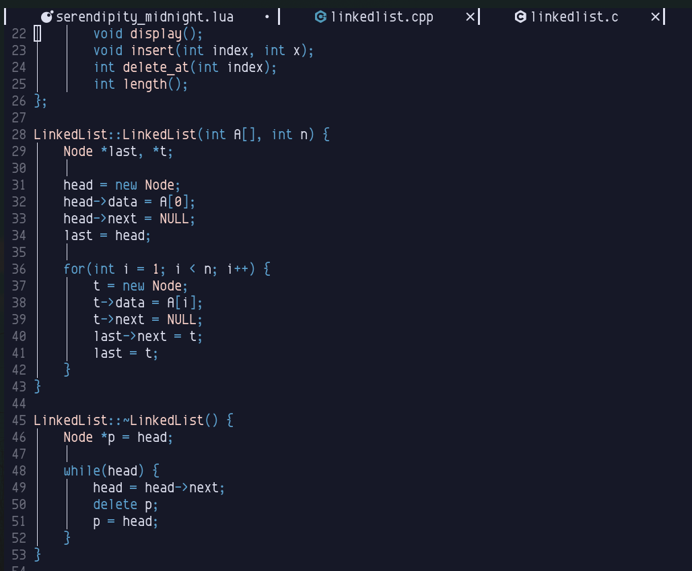

# Serendipity for Neovim
Still under development.

# Installation

1. Open **~/.config/nvim/lua/user/plugins.lua** or wherever you store your plugins file.
2. Write the following code into your plugins file. I am using packer in this
   example:
    ```lua
    /* packer */
    use({
        'AustinMay1/Serendipity.nvim',
        as = 'serendipity',
        config = function()
            vim.cmd.colorscheme('serendipity')
        end
    })
    ```
3. **Enjoy!**

# Screenshots Under this heading
**Midnight**



# Who ported the theme?
@AustinMay1
# Standard formatting
- Add the same header on the repo
- Call the repo as the app you are porting for.

